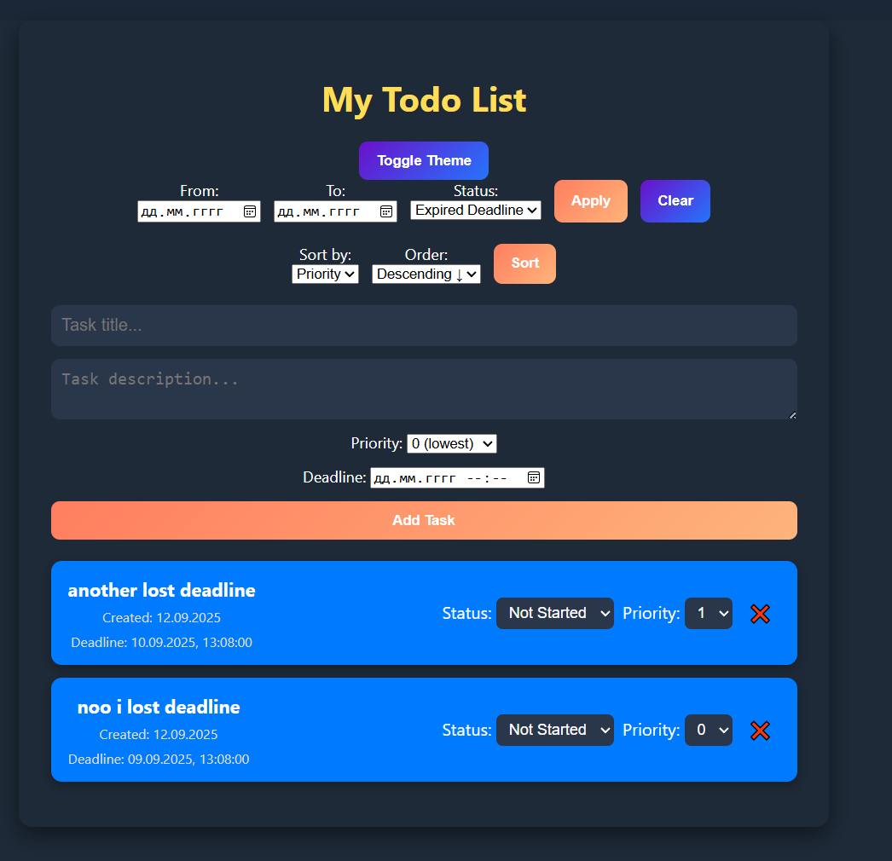

# TODOLIST

Created by Zhunis Ayanat, Тестовое задания для DMARK

## Todo List App

Приложение Todo List, реализованное с использованием Wails (Go + Frontend). Позволяет создавать задачи с приоритетами и дедлайнами, фильтровать, сортировать, отмечать как выполненные, удалять и хранить данные в PostgreSQL.

## Стек технологий

- Backend: Go + Wails

- Frontend: Vanilla JS, HTML, CSS

- База данных: PostgreSQL

- Хранение состояния: PostgreSQL (через репозиторий задач)

##  Функционал
Основные возможности
1. Создание задач
    - Ввод названия и описания задачи.
    - Установка приоритета (0–3).
    - Установка дедлайна (дата и время).
2. Отображение задач
    - Список всех задач на экране.
    - Цветовое обозначение по статусу:
        - Синий – Not Started
        - Жёлтый – In Progress
        - Зелёный – Done
        - Красный – просроченные задачи
    - Просроченные задачи подсвечиваются.
    - Зачеркивание текста выполненных задач.

3. Редактирование
    - Изменение статуса (Not Started, In Progress, Done).
    - Изменение приоритета задачи.

4. Удаление
    - Удаление задачи с подтверждением.

5. Фильтрация и сортировка
    - Фильтрация по статусу:
        - Все
        - Активные
        - Выполненные
        - Просроченные (Expired Deadline)
    - Фильтрация по дате создания (From / To).
    - Сортировка по дате создания, приоритету или дедлайну.
    - Выбор порядка: Asc / Desc.
6. Тема
    - Поддержка светлой и тёмной темы.
    - Адаптивный интерфейс для разных размеров экранов.
## How to run?
### Clone repository
```bash
    git clone git@github.com:barcek2281/todolist.git
    cd todolist
```

### Docker should run Postgres

```bash
docker-compose up --build -d
```
Это запустить докер в фоновом режиме, а порт постргесс будет 5433

### Copy config file

Linux, Mingw64
```bash
cp config.example.yaml config.yaml
```

### Running App

```bash
wails dev
```

## Example of working App
как все должно работать, при удачных запуске

---
белая тема, для приятного посмотра:

---
Фильтрация по статусу (in_progress) и сортировка по дате

---
Также система дедлайна и сортировка по приоритету
